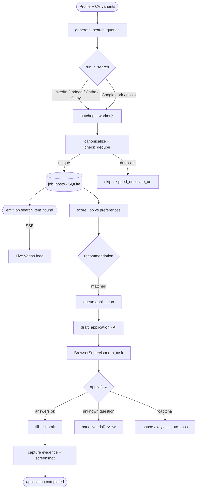
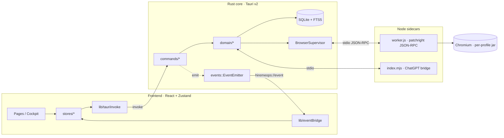
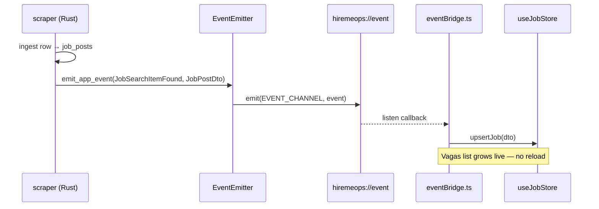
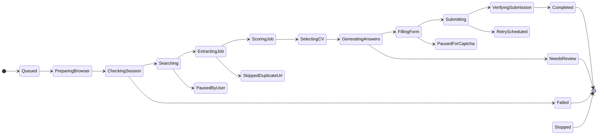
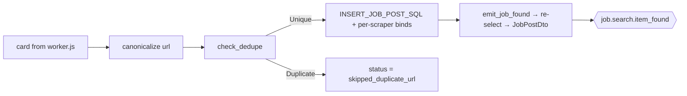
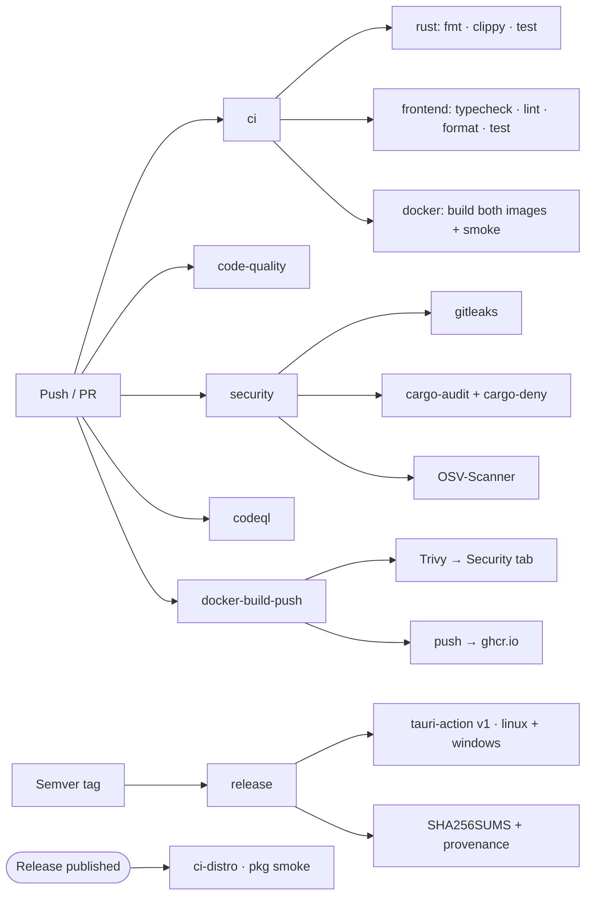
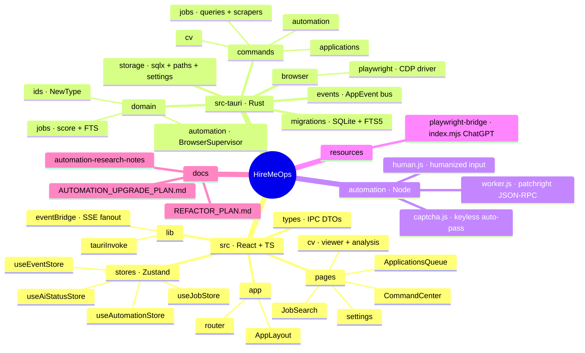

<div align="center">

<h1 align="center">
 HireMeOps
</h1>

A local-first job-search automation cockpit. One desktop app scrapes nine Brazilian + global job boards, scores every posting against your CV, drives real logged-in browser sessions to apply, and rewrites your résumé with a browser-driven LLM — no API keys, no cloud, your cookies never leave the machine. Built on Tauri v2 (Rust) + React 19.

**English** · [Português (BR)](README.pt-BR.md)

</div>

---

<h1 align="center">
 
 Demo | Command Center
</h1>

```
 HireMeOps v0.1.0                                        profile: matheus · variant: Backend Sr.

 ──────────────────────────────────────────────────────────────────────────
   Platforms                                          ● logged in   ✕ logged out
 ──────────────────────────────────────────────────────────────────────────
  ● LinkedIn   ● Catho   ● Gupy   ✕ InfoJobs   ● Indeed        [ Universal Login ]
 ──────────────────────────────────────────────────────────────────────────
   Live Vagas feed                                              streaming ● 14 new
 ──────────────────────────────────────────────────────────────────────────
  92  Senior Rust Engineer          · Nubank        · remote    matched
  87  Backend Engineer (Go)         · iFood         · hybrid    queued
  81  Plataforma / Rust             · inhire·post    · remote    discovered
 ──────────────────────────────────────────────────────────────────────────
  [Auto-connect ▸ off]   AI: generating…            Evidence Viewer ▸ watching
 ──────────────────────────────────────────────────────────────────────────

 ▶ Found jobs land the moment a search finishes — no refresh, no reload.
```

---

<h1 align="center">
  Supported Sources
</h1>

| Source | Mode | Engine | Status |
|---|---|---|---|
| **LinkedIn** (jobs) | Scrape + Easy Apply | patchright (stealth) | Stable |
| **LinkedIn** (hiring posts) | Scrape (feed) | patchright | Stable |
| **Indeed** | Scrape + SmartApply | patchright | Stable |
| **Catho** | Scrape + CV push | patchright | Stable |
| **Gupy** | Scrape + CV push | patchright | Stable |
| **InfoJobs** | Scrape + CV push | patchright | Stable |
| **Upwork** | Scrape (view-only) | patchright + Xvfb | Stable |
| **99freelas** | Scrape (view-only) | patchright | Stable |
| **Google dork** | Scrape (board discovery) | patchright | Stable |
| **ChatGPT** (CV rewrite/analysis) | Browser bridge | patchright (own jar) | Stable |

---

<h1 align="center">How It Works</h1>



---

<h1 align="center">
  Features
</h1>

* **Nine-board scraping**: LinkedIn, Indeed, Catho, Gupy, InfoJobs, Upwork, 99freelas, LinkedIn hiring posts, and a Google-dork board-discovery pass — one search fans out per role × skill × work-model
* **Live scrape streaming (SSE)**: every ingested job pushes a `job.search.item_found` event over a single Tauri channel — the Vagas list grows in real time, zero polling
* **CV-aware scoring**: `score_job` ranks each posting against your calibration (roles, skills, seniority, location, salary, work-model); excluded keywords + blocked companies hard-skip before scoring
* **Easy Apply automation**: LinkedIn Easy Apply and Indeed SmartApply are driven end-to-end; unknown form questions are answered from your CV via the AI bridge, and anything it can't answer parks for human review
* **CV push**: Catho, Gupy, and InfoJobs résumé fields are auto-filled from a selected profile variant
* **Browser-driven LLM (no API key)**: CV rewrite + analysis and Easy-Apply free-text answers run through a real logged-in ChatGPT session — your subscription, no token billing
* **One login, every site**: Universal Login opens all sites in one window; a shared per-profile Chromium cookie jar means you sign in once
* **Keyless captcha handling**: local evasion + wait auto-pass (no paid solver); default is to pause for a human unless `HIREMEOPS_AUTO_CAPTCHA` is set
* **Focus-safe**: automation windows stay visible so you can watch, but never steal focus (WM rule + CDP input that never moves your real mouse)
* **Live Evidence Viewer**: one shared preview pane watchable from any page; every run drops a screenshot + DOM + network bundle to `automation/captures/` on failure so ENI can self-diagnose
* **Local-first**: SQLite (with FTS5 full-text search) on disk; OAuth tokens in the OS keyring; nothing leaves the machine
* **Lean by default**: the heavy Chromium/CDP dependency is an opt-in Cargo feature — frontend/domain work compiles fast with no browser engine at all

---

<h1 align="center">
  What It Saves You
</h1>

Every action the cockpit performs replaces one you'd otherwise do by hand. The numbers below are conservative per-task estimates — the *counts* are whatever your own runs produce, the *minutes* are what that same work costs manually.

| Task | By hand | With HireMeOps | You save |
|---|---:|---:|---:|
| Find & triage one listing | ~2 min | ~5 s (lands in the live feed) | **~96%** |
| Read the JD & judge fit | ~3 min | 0 (auto-scored vs your CV) | **100%** |
| Fill one application form | ~12 min | ~1.5 min (review + confirm the parked form) | **~88%** |
| Tailor a CV to one role | ~20 min | ~3 min (skim the AI rewrite) | **~85%** |
| Send one connection request | ~1 min | 0 (auto-connect) | **100%** |

> **A 100-application week:** ~**28 h** by hand → ~**2.6 h** with the cockpit. Across the whole loop — searching, scoring, tailoring, applying — HireMeOps automates **~60–90%** of the repetitive work (60% if you review every form yourself, ~90% if you let auto-fill run). The busywork disappears; your judgement stays in the loop where it matters.

### What the *Ops* delivers

HireMeOps treats the job hunt like a running operation, not a one-off task. The design goals it's built against:

- Olhar para o negócio.
- Medir o desempenho da área.
- Alocar custos.
- Manter níveis de serviço interno.
- Reduzir custo.
- Otimizar estrutura.
- Ser ágil.
- Inovar nas soluções propostas.
- Fazer previsões acuradas.
- Não focar em "commodities".
- Gerar informação correta.
- Manter um Business Intelligence.
- Focar em ações de valor.
- Manter os processos críticos.
- Manter o ambiente seguro.
- Manter 24 x 7 x 365 toda a infraestrutura.
- Modelo reutilizável.
- Conquistar o pessoal do negócio.
- Ser mais eficiente, ser mais eficaz.
- Padronizar processos.
- Automatizar tarefas dos usuários.

---

<h1 align="center">
  Tech Stack
</h1>

<p align="center">
 
</p>

* **Shell / Runtime**: Tauri v2 (Rust core + system WebView), single binary
* **Backend**: Rust 2021 · `tokio` async · `sqlx` 0.9 + SQLite (FTS5) · `thiserror` domain errors · `tracing` structured spans
* **Frontend**: React 19 · TypeScript · Vite 8 · React Router 7 · Zustand 5 state · Tailwind 4 · HugeIcons · anime.js · Chart.js · pdf.js
* **Browser automation**: [patchright](https://github.com/Kaliiiiiiiiii-Vinyzu/patchright) 1.61 (stealth Playwright fork) via a Node `worker.js` JSON-RPC sidecar; `chromiumoxide` 0.7 (CDP) behind the `real-browser` feature
* **AI**: browser-driven ChatGPT session (no API key) + optional `reqwest` HTTP providers
* **CV I/O**: `pdf-extract` (read) · `lopdf` (write) · `zip` + `quick-xml` (DOCX)
* **Secrets**: OS keyring (`keyring`, native backends — no dbus/secret-service needed at build)
* **CI/CD**: GitHub Actions — `fmt` · `clippy -D warnings` (lean + all-features) · `cargo test` · frontend `typecheck · lint · format · test`
* **Quality**: `rustfmt` · Clippy · ESLint 10 (+ react-hooks 7) · Prettier · Vitest
* **Packaging**: `.deb` · `.rpm` · AppImage (Linux) · portable `.zip` (Windows, cross-compiled from Linux via mingw)
* **Optional container runtime**: Docker image for the worker in two flavours — a Playwright-base `noble` build and a lighter Chromium-only `slim` (Debian bookworm); opt-in, fails safe to the host

---

<h1 align="center">
 
 Installation & Setup
</h1>

```bash
git clone https://github.com/SobralCybersec/HireMeOps.git
cd HireMeOps
pnpm install
```

### Requirements

- **Rust** (stable) + Cargo
- **Node** 20+ and **pnpm**
- **Linux system deps** (Tauri v2 / WebKitGTK):
  ```bash
  # Debian/Ubuntu
  sudo apt-get install -y libwebkit2gtk-4.1-dev libgtk-3-dev \
    libayatana-appindicator3-dev librsvg2-dev
  ```
- A logged-in browser session per job site (done once via Universal Login)

### Run (development)

```bash
# Full cockpit — real browser engine enabled
pnpm app            # → tauri dev -f real-browser

# Frontend only (fast; no Chromium/CDP compiled)
pnpm dev            # → vite
```

> The automation engine lives behind the `real-browser` Cargo feature. Every app run/build script already passes `-f real-browser`; `pnpm dev` builds the UI alone for fast iteration.

### Build (release)

```bash
# Linux — .deb + .rpm + AppImage
pnpm build:linux            # NO_STRIP=true tauri build -f real-browser

# Linux — portable tarball
pnpm build:linux:portable

# Windows — cross-compiled from Linux (mingw) → portable .zip
pnpm build:windows
```

### Verify (the exact CI gates, locally)

```bash
pnpm verify                 # typecheck · lint · format:check · test
# Rust side:
cd src-tauri
cargo fmt --all -- --check
cargo clippy --no-default-features --all-targets -- -D warnings   # lean
cargo clippy --all-targets --all-features    -- -D warnings       # full
cargo test --all-features
```

### Cargo Features

| Feature | Default | Effect |
|---|---|---|
| *(none)* | ✅ | Lean build — frontend + domain + DB. **No Chromium/CDP compiled** (~70% of build time saved). Scraper/apply commands return "real-browser not enabled". |
| `real-browser` | opt-in | Pulls in `chromiumoxide` + `futures` and enables the full patchright/CDP automation engine. Wired into every app/build path (`-f real-browser`). |

```bash
cargo build                          # lean
cargo build --features real-browser  # full cockpit
```

### Optional: run the worker in Docker 

The browser worker runs on the host by default. If you'd rather not install Node + patchright + Chromium on the host, you can run it in a reproducible container instead — everything baked in, plus BR fonts, timezone, and locale for coherence. Settings ▸ General shows a live Docker check.

**Two image flavours — build whichever you want; both tag `hiremeops-worker:latest`, which the app looks for:**

```bash
npm run build:docker        # noble — Playwright base image (most tested, larger)
npm run build:docker:slim   # slim  — Debian bookworm + Chromium only (lighter)

HIREMEOPS_USE_DOCKER=1 pnpm app   # launch with the container worker
```

Or skip the build and **pull the CI-published image** from GHCR (the `docker-build-push` workflow builds, Trivy-scans, and publishes both variants on every push to the default branch):

```bash
docker pull ghcr.io/sobralcybersec/hiremeops-worker:slim
docker tag  ghcr.io/sobralcybersec/hiremeops-worker:slim hiremeops-worker:latest  # the tag the app looks for
HIREMEOPS_USE_DOCKER=1 pnpm app
```

| Flavour | Base | Trade |
|---|---|---|
| `noble` | `mcr.microsoft.com/playwright:v1.61.1-noble` | Most reliable; bundles all three browsers though we use only Chromium — larger |
| `slim` | `node:22-bookworm-slim` + `patchright install chromium` | Chromium only → noticeably smaller image |

> **Why not Alpine?** patchright's Chromium is glibc-only — Playwright dropped musl/Alpine support and Chromium won't launch there. Slim **Debian** is the lightest base that actually runs a browser.

It runs Chromium **headed under Xvfb** inside the container (not headless) and NATs out through your own residential IP, so the stealth posture matches the host path — the container is a packaging convenience, not a detection change. The switch is fail-safe: if Docker is missing, the daemon is down, or the image isn't built, the worker silently falls back to `node worker.js` on the host. The per-profile cookie jars are volume-mounted at their real paths, so logins persist exactly as on the host. A `.dockerignore` keeps the build context tiny (excludes `target/`, `node_modules/`, `.git`) — without it the build would ship ~18 GB to the daemon.

> **Detection tradeoff:** the hard-blocked sites (Indeed, Upwork, Cloudflare-gated boards, Catho, Google) still need the headed+Xvfb path — which the container provides. Don't run those headless anywhere.

---

<h1 align="center">
 
 Architecture
</h1>

HireMeOps is a Tauri v2 app: a React frontend calls typed Rust **IPC commands**, and the Rust core pushes **events** back over one channel. The browser engine is a Node sidecar the Rust side drives over JSON-RPC.



### Real-time event bus (SSE-style)

Every backend feature emits `AppEvent`s through `EventEmitter::emit_app_event` onto the single Tauri channel `hiremeops://event`. The frontend subscribes **once** in `lib/eventBridge.ts` and fans out to Zustand stores — there is no polling anywhere in the UI.



### Event List

The authoritative wire contract is the `AppEventType` enum (`src-tauri/src/events/mod.rs`). Each variant serializes to its `serde` string:

| Event (`type`) | Emitted when | Payload |
|---|---|---|
| `cv.import.started` | A CV upload/parse begins | `{ fileName }` |
| `cv.parse.progress` | CV parsing advances | `{ phase }` |
| `cv.analysis.done` | AI CV analysis completes | analysis report |
| `job.search.started` | A scrape run begins | `{ platform }` |
| `job.search.item_found` | **Each** job ingested (live feed) | `JobPostDto` |
| `job.match.done` | Scoring finished for a run | `{ scored }` |
| `ai.progress` | An AI task changes phase | `{ phase, scope }` |
| `application.started` | An apply task starts | `{ taskId }` |
| `application.needs_review` | Apply parked for a human | `{ taskId, reason }` |
| `application.failed` | Apply failed | `{ taskId, error }` |
| `application.completed` | Apply submitted + verified | `{ taskId }` |
| `automation.paused_for_captcha` | A captcha wall was hit | `{ url }` |
| `automation.evidence_saved` | Screenshot/DOM bundle written | `{ path }` |
| `automation.stopped` | Run stopped (user/limit) | `{ reason }` |
| `automation.state` | Authoritative lifecycle transition | `{ state, taskId?, detail?, watchUrl? }` |
| `log` | Raw/unclassified backend line | any |

### Automation lifecycle (state machine)

The cockpit never guesses — it follows the engine's `automation.state` events. `start` paints only an optimistic ack; the backend drives the real lifecycle.



### Scraper INSERT — one canonical path

All nine scrapers ingest through a single `INSERT_JOB_POST_SQL` constant (schema-coupled SQL lives once); each keeps its own `.bind()` chain because per-platform values legitimately differ (real vs `None` salary / contact_email / remote_mode). The emit path is shared via `emit_job_found`.



---

<h1 align="center">
  GitHub Actions CI/CD
</h1>

Eight workflows, every `uses:` **pinned to a commit SHA** (2026 supply-chain norm), kept fresh by Dependabot. Push/PR gates stay fast; the heavy builds run on tags and releases.

### Workflow Matrix

| Workflow | Trigger | What it does |
|---|---|---|
| **`ci`** | push / PR | `rust` (fmt · clippy lean **and** all-features · test) · `frontend` (typecheck · lint · format · test) · `docker` (build both worker images + smoke) |
| **`code-quality`** | push / PR (shell + CI paths) | `actionlint` + **`zizmor`** (Actions SAST) + `shellcheck` + `shfmt` on the shell scripts |
| **`security`** | push / PR / weekly | `gitleaks` v3 · **`cargo-audit`** · **`cargo-deny`** (advisories + licenses + bans) · **OSV-Scanner** (pnpm + Cargo lockfiles) · license check |
| **`codeql`** | push / PR / weekly | CodeQL SAST — `javascript-typescript` + `actions` (Rust deps covered by audit/deny/OSV) |
| **`docker-build-push`** | push / PR | Build worker images (noble + slim) → **Trivy** scan (→ Security tab) → push to GHCR with provenance + SBOM |
| **`release`** | semver tag | **tauri-action v1** native matrix (Linux `.deb`/`.rpm`/AppImage + Windows installers) → draft → SHA256SUMS + build provenance → publish |
| **`performance`** | PR / weekly | Frontend bundle-size report (total + largest chunks, soft threshold) |
| **`ci-distro`** | release / dispatch | Package-install smoke — install the `.deb`/`.rpm` in Debian/Ubuntu/Fedora containers + `ldd` link-check |



> The **lean clippy pass is deliberate**: it guarantees the default (no-`real-browser`) build stays warning-clean, catching any missing `#[cfg(feature = "real-browser")]` gate before it reaches a contributor.

> **Supply-chain posture (2026):** every action is SHA-pinned (not a moving tag), top-level `permissions: contents: read` with per-job elevation, `gitleaks` v3 (v2's Node 20 runtime is removed from runners in Sept 2026), and `trivy-action` pinned to a post-incident SHA after the March 2026 tag-hijack. Dependabot bumps the pins — and their `# vX` comments — weekly.

---

<h1 align="center">
  Project Structure
</h1>



---

<h1 align="center">
  Limitations & Notes
</h1>

### Out of Scope
- **No paid captcha solvers**: keyless local auto-pass only; default behaviour is to pause for a human
- **No cloud / no accounts**: everything is local-first; there is no HireMeOps server
- **View-only sources**: Upwork + 99freelas are scraped for discovery, not auto-applied
- **AI**: the browser-driven ChatGPT path needs a real logged-in session; there is no headless model shipped

### Notes & Guarantees
- **Cookies never leave the machine** — a per-profile Chromium jar under the app data dir
- **Windows stay visible, never steal focus** — you can watch a run without it grabbing your desktop
- **Failure is debuggable** — screenshot + DOM + network bundle auto-saved to `automation/captures/`
- **Rate discipline** — coherence over spoofing; humanized input + pacing (see `docs/AUTOMATION_UPGRADE_PLAN.md`)
- **Lean build stays green** — CI lints the no-`real-browser` build separately

---

<h1 align="center"> References</h1>

> Core frameworks, the browser-automation stack, and the anti-bot / job-board research that shaped the engine. Third-party projects belong to their authors.

<h2 align="center">

**Tauri v2**: [tauri.app](https://v2.tauri.app/) 

</h2>

<h2 align="center">

**React**: [react.dev](https://react.dev/) · **Vite**: [vite.dev](https://vite.dev/) · **Zustand**: [pmndrs/zustand](https://github.com/pmndrs/zustand) 

</h2>

<h2 align="center">

**sqlx**: [launchbadge/sqlx](https://github.com/launchbadge/sqlx) · **SQLite FTS5**: [sqlite.org/fts5](https://www.sqlite.org/fts5.html) 

</h2>

<h2 align="center">

**patchright** (stealth Playwright fork): [Kaliiiiiiiiii-Vinyzu/patchright](https://github.com/Kaliiiiiiiiii-Vinyzu/patchright) 

</h2>

<h2 align="center">

**chromiumoxide** (CDP driver, Rust): [crates.io/crates/chromiumoxide](https://crates.io/crates/chromiumoxide) 

</h2>

<h2 align="center">

**CDP-Patches** (input-layer anti-detection): [Kaliiiiiiiiii-Vinyzu/CDP-Patches](https://github.com/Kaliiiiiiiiii-Vinyzu/CDP-Patches) 

</h2>

<h2 align="center">

**Chrome DevTools Protocol**: [chromedevtools.github.io/devtools-protocol](https://chromedevtools.github.io/devtools-protocol/tot/Input/) 

</h2>

<h2 align="center">

**spider_chrome** (CDP reference): [spider-rs/spider_chrome](https://github.com/spider-rs/spider_chrome) 

</h2>

<h2 align="center">

**Playwright stealth research (2026)**: [scrapfly.io — best stealth browsers](https://scrapfly.io/blog/posts/best-stealth-browsers) · [anti-detect benchmark](https://ianlpaterson.com/blog/anti-detect-browser-benchmark-patchright-nodriver-curl-cffi/) 

</h2>

<h2 align="center">

**CDP detection**: [scrappey.com — what is CDP detection](https://scrappey.com/qa/anti-bot/what-is-cdp-detection) · **Cloudflare Turnstile**: [scrapfly.io](https://scrapfly.io/blog/posts/how-to-bypass-cloudflare-turnstile) 

</h2>

<h2 align="center">

**Google dork / SERP 2026** (num=100 removal, `after:` filter): [locomotive.agency](https://locomotive.agency/blog/google-removes-num100-parameter-what-this-means-for-your-website/) · [digitalapplied — search operators](https://www.digitalapplied.com/blog/google-search-operators-complete-2026-reference) 

</h2>

<h2 align="center">

**LinkedIn automation limits (2026)**: [getsales.io](https://getsales.io/blog/linkedin-automation-safety-guide-2026/) · [phantombuster](https://phantombuster.com/blog/social-selling/linkedin-limits-2025-safe-automation-strategies/) 

</h2>

<h2 align="center">

**Indeed rate limiting**: [docs.indeed.com](https://docs.indeed.com/getstarted/rate-limiting) · **Gupy API ref**: [apify — gupy-vagas-brasil](https://apify.com/pmodinger/gupy-vagas-brasil/api/openapi) 

</h2>

<h2 align="center">

**React Router security (2026)**: [remix-run/react-router releases](https://github.com/remix-run/react-router/releases) · [netlify changelog](https://www.netlify.com/changelog/2026-07-23-react-router-security-vulnerabilities/) 

</h2>

<h2 align="center">

**Chromium Ozone/Wayland**: [phoronix](https://www.phoronix.com/news/Chromium-Ozone-Wayland-2025) · **Headless Chrome**: [developer.chrome.com](https://developer.chrome.com/blog/headless-chrome) 

</h2>

<h2 align="center">

**pdf-extract** · **lopdf** · **pdf.js**: [mozilla/pdf.js](https://github.com/mozilla/pdf.js) 

</h2>

<p align="center">
 <sub>Full research trail (browser benchmarks, CDP keyboard, captcha, job-board scraping, stealth) lives in <code>docs/automation-research-notes/</code> and <code>docs/AUTOMATION_UPGRADE_PLAN.md</code>. All third-party projects and vendor services remain the property of their respective authors and maintainers.</sub>
</p>

---

<h1 align="center">Credits</h1>

<p align="center">
 Matheus Sobral<br>
 <a href="https://github.com/SobralCybersec">github.com/SobralCybersec</a><br>
 MIT © 2026
</p>

<p align="center">
 <sub>Built on Tauri, React, sqlx, and patchright — credit to their upstream authors.</sub>
</p>
