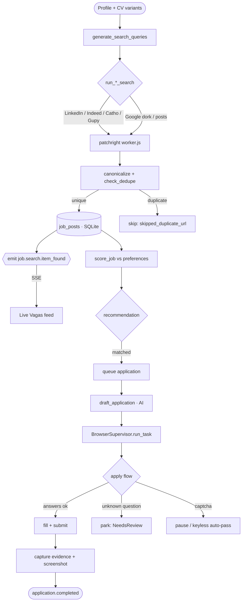
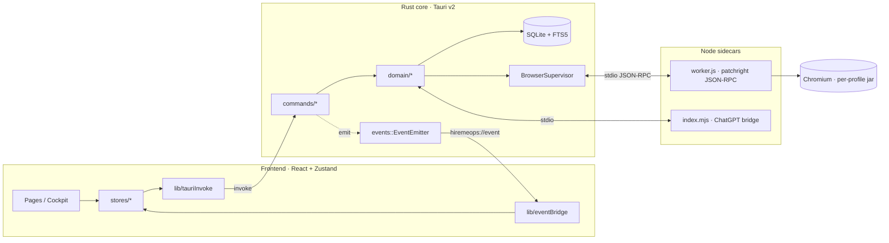
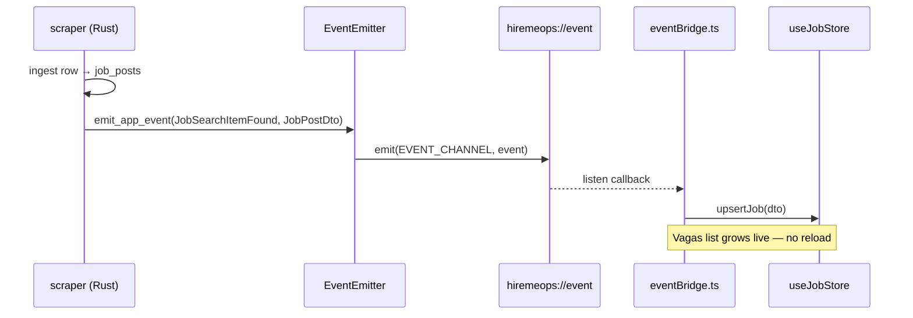
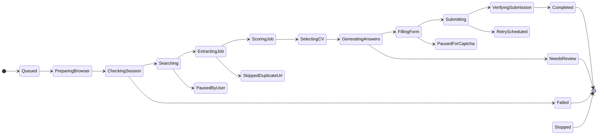
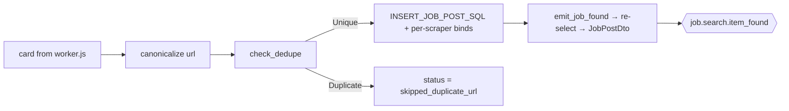
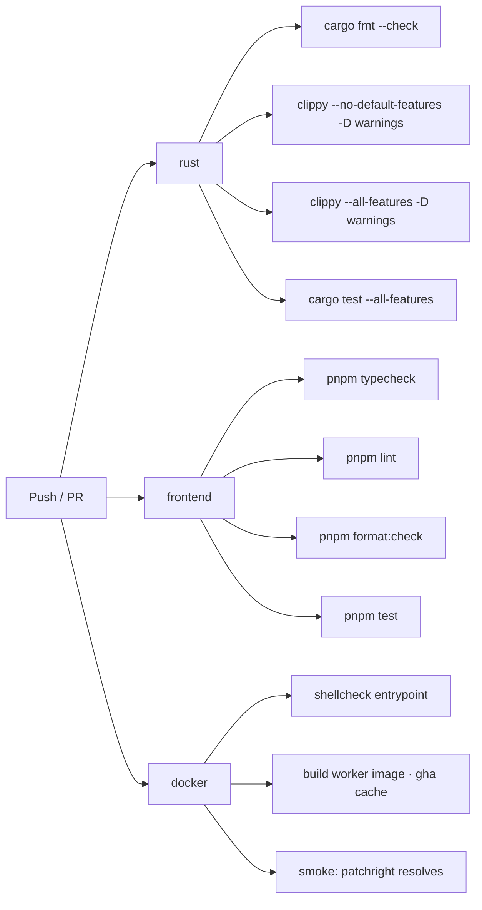
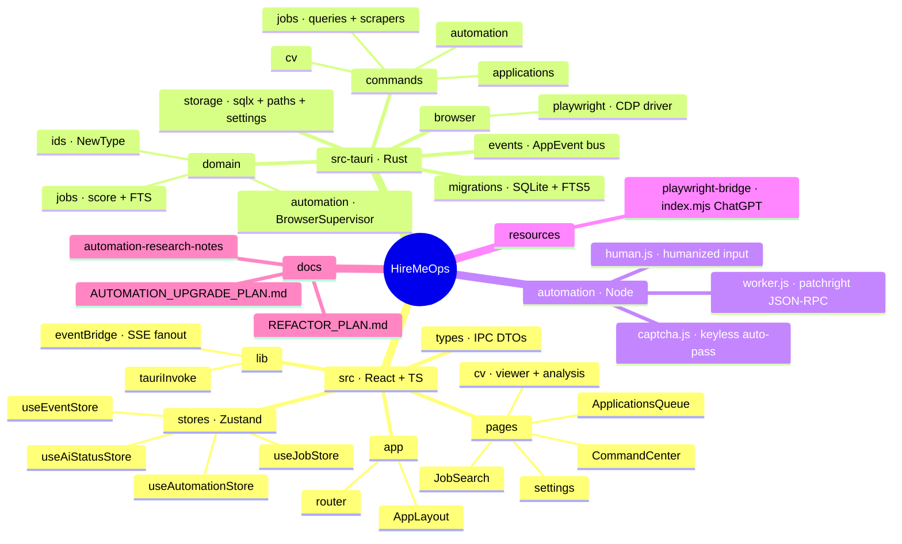

<div align="center">

<h1 align="center">
 HireMeOps
</h1>

Um cockpit local-first de automação de busca de vagas. Um único app desktop faz scraping de nove portais de emprego brasileiros + globais, pontua cada vaga contra o seu currículo, dirige sessões reais de navegador logado para se candidatar e reescreve o seu currículo com um LLM operado via navegador — sem chaves de API, sem nuvem, seus cookies nunca saem da máquina. Construído sobre Tauri v2 (Rust) + React 19.

[English](README.md) · **Português (BR)**

</div>

---

<h1 align="center">
 
 Demo | Command Center
</h1>

```
 HireMeOps v0.1.0                                        profile: matheus · variant: Backend Sr.

 ──────────────────────────────────────────────────────────────────────────
   Platforms                                          ● logged in   ✕ logged out
 ──────────────────────────────────────────────────────────────────────────
  ● LinkedIn   ● Catho   ● Gupy   ✕ InfoJobs   ● Indeed        [ Universal Login ]
 ──────────────────────────────────────────────────────────────────────────
   Live Vagas feed                                              streaming ● 14 new
 ──────────────────────────────────────────────────────────────────────────
  92  Senior Rust Engineer          · Nubank        · remote    matched
  87  Backend Engineer (Go)         · iFood         · hybrid    queued
  81  Plataforma / Rust             · inhire·post    · remote    discovered
 ──────────────────────────────────────────────────────────────────────────
  [Auto-connect ▸ off]   AI: generating…            Evidence Viewer ▸ watching
 ──────────────────────────────────────────────────────────────────────────

 ▶ As vagas encontradas aparecem no instante em que a busca termina — sem refresh, sem reload.
```

---

<h1 align="center">
  Fontes Suportadas
</h1>

| Fonte | Modo | Engine | Status |
|---|---|---|---|
| **LinkedIn** (vagas) | Scrape + Easy Apply | patchright (stealth) | Estável |
| **LinkedIn** (posts de contratação) | Scrape (feed) | patchright | Estável |
| **Indeed** | Scrape + SmartApply | patchright | Estável |
| **Catho** | Scrape + push de currículo | patchright | Estável |
| **Gupy** | Scrape + push de currículo | patchright | Estável |
| **InfoJobs** | Scrape + push de currículo | patchright | Estável |
| **Upwork** | Scrape (somente leitura) | patchright + Xvfb | Estável |
| **99freelas** | Scrape (somente leitura) | patchright | Estável |
| **Google dork** | Scrape (descoberta de portais) | patchright | Estável |
| **ChatGPT** (reescrita/análise de CV) | Ponte via navegador | patchright (jar próprio) | Estável |

---

<h1 align="center">Como Funciona</h1>



---

<h1 align="center">
  Recursos
</h1>

* **Scraping de nove portais**: LinkedIn, Indeed, Catho, Gupy, InfoJobs, Upwork, 99freelas, posts de contratação do LinkedIn e uma passada de descoberta via Google dork — cada busca se ramifica por cargo × skill × modelo de trabalho
* **Streaming de scraping ao vivo (SSE)**: cada vaga ingerida dispara um evento `job.search.item_found` por um único canal Tauri — a lista de Vagas cresce em tempo real, sem polling
* **Pontuação ciente do CV**: `score_job` classifica cada vaga contra a sua calibração (cargos, skills, senioridade, localização, salário, modelo de trabalho); palavras-chave excluídas + empresas bloqueadas são puladas antes da pontuação
* **Automação de Easy Apply**: LinkedIn Easy Apply e Indeed SmartApply são conduzidos de ponta a ponta; perguntas de formulário desconhecidas são respondidas a partir do seu CV via ponte de IA, e o que ela não conseguir responder fica parado para revisão humana
* **Push de currículo**: os campos de currículo de Catho, Gupy e InfoJobs são preenchidos automaticamente a partir de uma variante de perfil selecionada
* **LLM operado via navegador (sem chave de API)**: reescrita + análise de CV e respostas de texto livre no Easy Apply passam por uma sessão real de ChatGPT logada — sua assinatura, sem cobrança por token
* **Um login, todos os sites**: o Login Universal abre todos os sites em uma única janela; um cookie jar Chromium compartilhado por perfil significa que você entra uma vez só
* **Tratamento de captcha sem chave**: evasão local + espera com auto-resolução (sem solver pago); o padrão é pausar para um humano, a menos que `HIREMEOPS_AUTO_CAPTCHA` esteja setado
* **Seguro quanto ao foco**: as janelas de automação ficam visíveis para você acompanhar, mas nunca roubam o foco (regra do WM + input via CDP que nunca move o seu mouse real)
* **Evidence Viewer ao vivo**: um painel de preview compartilhado, observável de qualquer página; cada execução deixa um pacote de screenshot + DOM + rede em `automation/captures/` em caso de falha, para a ENI se autodiagnosticar
* **Local-first**: SQLite (com busca full-text FTS5) em disco; tokens OAuth no keyring do SO; nada sai da máquina
* **Enxuto por padrão**: a pesada dependência Chromium/CDP é uma feature Cargo opcional — trabalho de frontend/domínio compila rápido, sem nenhum engine de navegador

---

<h1 align="center">
  O Que Isso Te Poupa
</h1>

Cada ação que o cockpit executa substitui uma que você faria à mão. Os números abaixo são estimativas conservadoras por tarefa — as *contagens* são o que as suas próprias execuções produzem, os *minutos* são o que esse mesmo trabalho custa manualmente.

| Tarefa | À mão | Com o HireMeOps | Você poupa |
|---|---:|---:|---:|
| Encontrar & triar uma vaga | ~2 min | ~5 s (cai no feed ao vivo) | **~96%** |
| Ler a descrição & avaliar o fit | ~3 min | 0 (pontuado automaticamente vs seu CV) | **100%** |
| Preencher um formulário de candidatura | ~12 min | ~1,5 min (revisar + confirmar o formulário parado) | **~88%** |
| Adaptar um CV a uma vaga | ~20 min | ~3 min (dar uma olhada na reescrita da IA) | **~85%** |
| Enviar um pedido de conexão | ~1 min | 0 (auto-connect) | **100%** |

> **Uma semana de 100 candidaturas:** ~**28 h** à mão → ~**2,6 h** com o cockpit. Ao longo de todo o fluxo — buscar, pontuar, adaptar, candidatar — o HireMeOps automatiza **~60–90%** do trabalho repetitivo (60% se você revisar cada formulário, ~90% se deixar o auto-preenchimento rodar). A parte braçal some; o seu julgamento fica no circuito onde ele importa.

### O que o *Ops* entrega

O HireMeOps trata a busca de emprego como uma operação em andamento, não como uma tarefa avulsa. Os objetivos de design contra os quais ele foi construído:

- Olhar para o negócio.
- Medir o desempenho da área.
- Alocar custos.
- Manter níveis de serviço interno.
- Reduzir custo.
- Otimizar estrutura.
- Ser ágil.
- Inovar nas soluções propostas.
- Fazer previsões acuradas.
- Não focar em "commodities".
- Gerar informação correta.
- Manter um Business Intelligence.
- Focar em ações de valor.
- Manter os processos críticos.
- Manter o ambiente seguro.
- Manter 24 x 7 x 365 toda a infraestrutura.
- Modelo reutilizável.
- Conquistar o pessoal do negócio.
- Ser mais eficiente, ser mais eficaz.
- Padronizar processos.
- Automatizar tarefas dos usuários.

---

<h1 align="center">
  Stack Técnica
</h1>

<p align="center">
 
</p>

* **Shell / Runtime**: Tauri v2 (núcleo Rust + WebView do sistema), binário único
* **Backend**: Rust 2021 · async `tokio` · `sqlx` 0.9 + SQLite (FTS5) · erros de domínio `thiserror` · spans estruturados `tracing`
* **Frontend**: React 19 · TypeScript · Vite 8 · React Router 7 · estado Zustand 5 · Tailwind 4 · HugeIcons · anime.js · Chart.js · pdf.js
* **Automação de navegador**: [patchright](https://github.com/Kaliiiiiiiiii-Vinyzu/patchright) 1.61 (fork stealth do Playwright) via um sidecar JSON-RPC Node `worker.js`; `chromiumoxide` 0.7 (CDP) atrás da feature `real-browser`
* **IA**: sessão de ChatGPT operada via navegador (sem chave de API) + provedores HTTP `reqwest` opcionais
* **I/O de CV**: `pdf-extract` (leitura) · `lopdf` (escrita) · `zip` + `quick-xml` (DOCX)
* **Segredos**: keyring do SO (`keyring`, backends nativos — sem necessidade de dbus/secret-service no build)
* **CI/CD**: GitHub Actions — `fmt` · `clippy -D warnings` (lean + all-features) · `cargo test` · frontend `typecheck · lint · format · test`
* **Qualidade**: `rustfmt` · Clippy · ESLint 10 (+ react-hooks 7) · Prettier · Vitest
* **Empacotamento**: `.deb` · `.rpm` · AppImage (Linux) · `.zip` portátil (Windows, cross-compilado do Linux via mingw)
* **Runtime opcional em container**: imagem Docker para o worker em dois sabores — um build `noble` com base Playwright e um `slim` (Debian bookworm) mais leve, só com Chromium; opt-in, com fallback seguro para o host

---

<h1 align="center">
 
 Instalação & Setup
</h1>

```bash
git clone https://github.com/SobralCybersec/HireMeOps.git
cd HireMeOps
pnpm install
```

### Requisitos

- **Rust** (stable) + Cargo
- **Node** 20+ e **pnpm**
- **Dependências de sistema no Linux** (Tauri v2 / WebKitGTK):
  ```bash
  # Debian/Ubuntu
  sudo apt-get install -y libwebkit2gtk-4.1-dev libgtk-3-dev \
    libayatana-appindicator3-dev librsvg2-dev
  ```
- Uma sessão de navegador logada por site de vagas (feita uma vez via Login Universal)

### Rodar (desenvolvimento)

```bash
# Cockpit completo — engine de navegador real habilitado
pnpm app            # → tauri dev -f real-browser

# Somente frontend (rápido; sem Chromium/CDP compilado)
pnpm dev            # → vite
```

> O engine de automação vive atrás da feature Cargo `real-browser`. Todo script de run/build do app já passa `-f real-browser`; `pnpm dev` compila só a UI, para iteração rápida.

### Build (release)

```bash
# Linux — .deb + .rpm + AppImage
pnpm build:linux            # NO_STRIP=true tauri build -f real-browser

# Linux — tarball portátil
pnpm build:linux:portable

# Windows — cross-compilado do Linux (mingw) → .zip portátil
pnpm build:windows
```

### Verificar (os gates exatos do CI, localmente)

```bash
pnpm verify                 # typecheck · lint · format:check · test
# Lado Rust:
cd src-tauri
cargo fmt --all -- --check
cargo clippy --no-default-features --all-targets -- -D warnings   # lean
cargo clippy --all-targets --all-features    -- -D warnings       # completo
cargo test --all-features
```

### Features do Cargo

| Feature | Padrão | Efeito |
|---|---|---|
| *(nenhuma)* | ✅ | Build enxuto — frontend + domínio + DB. **Sem Chromium/CDP compilado** (~70% do tempo de build economizado). Comandos de scraper/apply retornam "real-browser not enabled". |
| `real-browser` | opt-in | Puxa `chromiumoxide` + `futures` e habilita o engine completo de automação patchright/CDP. Ligado em todo caminho de run/build do app (`-f real-browser`). |

```bash
cargo build                          # enxuto
cargo build --features real-browser  # cockpit completo
```

### Opcional: rodar o worker em Docker 

O worker de navegador roda no host por padrão. Se você preferir não instalar Node + patchright + Chromium no host, dá pra rodá-lo em um container reproduzível — tudo embutido, mais fontes BR, timezone e locale para coerência. Configurações ▸ Geral mostra uma checagem de Docker ao vivo.

**Dois sabores de imagem — construa o que quiser; ambos recebem a tag `hiremeops-worker:latest`, que é a que o app procura:**

```bash
npm run build:docker        # noble — imagem base do Playwright (mais testada, maior)
npm run build:docker:slim   # slim  — Debian bookworm + só Chromium (mais leve)

HIREMEOPS_USE_DOCKER=1 pnpm app   # sobe com o worker em container
```

| Sabor | Base | Trade |
|---|---|---|
| `noble` | `mcr.microsoft.com/playwright:v1.61.1-noble` | Mais confiável; empacota os três navegadores mesmo usando só Chromium — maior |
| `slim` | `node:22-bookworm-slim` + `patchright install chromium` | Só Chromium → imagem sensivelmente menor |

> **Por que não Alpine?** O Chromium do patchright é glibc-only — o Playwright abandonou o suporte a musl/Alpine e o Chromium não sobe lá. O **Debian** slim é a base mais leve que de fato roda um navegador.

Ele roda o Chromium **headed sob Xvfb** dentro do container (não headless) e faz NAT pela sua própria IP residencial, então a postura de stealth é a mesma do caminho no host — o container é uma conveniência de empacotamento, não uma mudança de detecção. O switch é à prova de falha: se o Docker estiver ausente, o daemon estiver parado, ou a imagem não estiver construída, o worker silenciosamente volta para `node worker.js` no host. Os cookie jars por perfil são montados por volume nos seus caminhos reais, então os logins persistem exatamente como no host. Um `.dockerignore` mantém o contexto de build minúsculo (exclui `target/`, `node_modules/`, `.git`) — sem ele o build mandaria ~18 GB para o daemon.

> **Trade-off de detecção:** os sites com bloqueio pesado (Indeed, Upwork, portais atrás de Cloudflare, Catho, Google) ainda precisam do caminho headed+Xvfb — que o container fornece. Não rode esses em headless, em lugar nenhum.

---

<h1 align="center">
 
 Arquitetura
</h1>

O HireMeOps é um app Tauri v2: um frontend React chama **comandos IPC** Rust tipados, e o núcleo Rust empurra **eventos** de volta por um único canal. O engine de navegador é um sidecar Node que o lado Rust dirige via JSON-RPC.



### Barramento de eventos em tempo real (estilo SSE)

Cada feature de backend emite `AppEvent`s por `EventEmitter::emit_app_event` no único canal Tauri `hiremeops://event`. O frontend assina **uma vez** em `lib/eventBridge.ts` e distribui para as stores Zustand — não há polling em lugar nenhum da UI.



### Lista de Eventos

O contrato de fio autoritativo é o enum `AppEventType` (`src-tauri/src/events/mod.rs`). Cada variante serializa para a sua string `serde`:

| Evento (`type`) | Emitido quando | Payload |
|---|---|---|
| `cv.import.started` | Um upload/parse de CV começa | `{ fileName }` |
| `cv.parse.progress` | O parse do CV avança | `{ phase }` |
| `cv.analysis.done` | A análise de CV pela IA conclui | relatório de análise |
| `job.search.started` | Uma execução de scrape começa | `{ platform }` |
| `job.search.item_found` | **Cada** vaga ingerida (feed ao vivo) | `JobPostDto` |
| `job.match.done` | Pontuação concluída para uma execução | `{ scored }` |
| `ai.progress` | Uma tarefa de IA muda de fase | `{ phase, scope }` |
| `application.started` | Uma tarefa de candidatura inicia | `{ taskId }` |
| `application.needs_review` | Candidatura parada para um humano | `{ taskId, reason }` |
| `application.failed` | Candidatura falhou | `{ taskId, error }` |
| `application.completed` | Candidatura enviada + verificada | `{ taskId }` |
| `automation.paused_for_captcha` | Um muro de captcha foi atingido | `{ url }` |
| `automation.evidence_saved` | Pacote de screenshot/DOM gravado | `{ path }` |
| `automation.stopped` | Execução parada (usuário/limite) | `{ reason }` |
| `automation.state` | Transição autoritativa de ciclo de vida | `{ state, taskId?, detail?, watchUrl? }` |
| `log` | Linha de backend crua/não classificada | qualquer |

### Ciclo de vida da automação (máquina de estados)

O cockpit nunca adivinha — ele segue os eventos `automation.state` do engine. `start` pinta apenas um ack otimista; o backend conduz o ciclo de vida real.



### INSERT do scraper — um caminho canônico

Todos os nove scrapers ingerem através de uma única constante `INSERT_JOB_POST_SQL` (o SQL acoplado ao schema vive num único lugar); cada um mantém a sua própria cadeia de `.bind()` porque os valores por plataforma legitimamente diferem (salário / contact_email / remote_mode reais vs `None`). O caminho de emit é compartilhado via `emit_job_found`.



---

<h1 align="center">
  GitHub Actions CI/CD
</h1>

### Matriz de Workflow

| Job | Gatilho | Passos |
|---|---|---|
| `rust` | push / PR | `fmt --check` · `clippy` (lean **e** all-features, `-D warnings`) · `cargo test --all-features` |
| `frontend` | push / PR | `typecheck` · `lint` · `format:check` · `test` |
| `docker` | push / PR | `shellcheck` no entrypoint · **build** da imagem do worker (`npm install` + `patchright install chromium`, com cache gha) · smoke-run (Node resolve o patchright) |



> A **passada lean do clippy é deliberada**: ela garante que o build padrão (sem `real-browser`) fique livre de warnings, pegando qualquer gate `#[cfg(feature = "real-browser")]` faltando antes de chegar num contribuidor.

---

<h1 align="center">
  Estrutura do Projeto
</h1>



---

<h1 align="center">
  Limitações & Observações
</h1>

### Fora de Escopo
- **Sem solvers de captcha pagos**: apenas auto-resolução local sem chave; o comportamento padrão é pausar para um humano
- **Sem nuvem / sem contas**: tudo é local-first; não existe servidor HireMeOps
- **Fontes somente leitura**: Upwork + 99freelas são raspados para descoberta, não para candidatura automática
- **IA**: o caminho de ChatGPT via navegador precisa de uma sessão real logada; não há modelo headless embarcado

### Observações & Garantias
- **Cookies nunca saem da máquina** — um jar Chromium por perfil dentro do diretório de dados do app
- **Janelas ficam visíveis, nunca roubam o foco** — você acompanha uma execução sem ela sequestrar o seu desktop
- **Falha é depurável** — pacote de screenshot + DOM + rede salvo automaticamente em `automation/captures/`
- **Disciplina de rate** — coerência acima de spoofing; input humanizado + cadência (veja `docs/AUTOMATION_UPGRADE_PLAN.md`)
- **Build enxuto continua verde** — o CI faz lint do build sem `real-browser` separadamente

---

<h1 align="center"> Referências</h1>

> Frameworks centrais, a stack de automação de navegador e a pesquisa de anti-bot / portais de emprego que moldaram o engine. Projetos de terceiros pertencem aos seus autores.

<h2 align="center">

**Tauri v2**: [tauri.app](https://v2.tauri.app/) 

</h2>

<h2 align="center">

**React**: [react.dev](https://react.dev/) · **Vite**: [vite.dev](https://vite.dev/) · **Zustand**: [pmndrs/zustand](https://github.com/pmndrs/zustand) 

</h2>

<h2 align="center">

**sqlx**: [launchbadge/sqlx](https://github.com/launchbadge/sqlx) · **SQLite FTS5**: [sqlite.org/fts5](https://www.sqlite.org/fts5.html) 

</h2>

<h2 align="center">

**patchright** (fork stealth do Playwright): [Kaliiiiiiiiii-Vinyzu/patchright](https://github.com/Kaliiiiiiiiii-Vinyzu/patchright) 

</h2>

<h2 align="center">

**chromiumoxide** (driver CDP, Rust): [crates.io/crates/chromiumoxide](https://crates.io/crates/chromiumoxide) 

</h2>

<h2 align="center">

**CDP-Patches** (anti-detecção na camada de input): [Kaliiiiiiiiii-Vinyzu/CDP-Patches](https://github.com/Kaliiiiiiiiii-Vinyzu/CDP-Patches) 

</h2>

<h2 align="center">

**Chrome DevTools Protocol**: [chromedevtools.github.io/devtools-protocol](https://chromedevtools.github.io/devtools-protocol/tot/Input/) 

</h2>

<h2 align="center">

**spider_chrome** (referência de CDP): [spider-rs/spider_chrome](https://github.com/spider-rs/spider_chrome) 

</h2>

<h2 align="center">

**Pesquisa de stealth do Playwright (2026)**: [scrapfly.io — best stealth browsers](https://scrapfly.io/blog/posts/best-stealth-browsers) · [anti-detect benchmark](https://ianlpaterson.com/blog/anti-detect-browser-benchmark-patchright-nodriver-curl-cffi/) 

</h2>

<h2 align="center">

**Detecção de CDP**: [scrappey.com — what is CDP detection](https://scrappey.com/qa/anti-bot/what-is-cdp-detection) · **Cloudflare Turnstile**: [scrapfly.io](https://scrapfly.io/blog/posts/how-to-bypass-cloudflare-turnstile) 

</h2>

<h2 align="center">

**Google dork / SERP 2026** (remoção do num=100, filtro `after:`): [locomotive.agency](https://locomotive.agency/blog/google-removes-num100-parameter-what-this-means-for-your-website/) · [digitalapplied — search operators](https://www.digitalapplied.com/blog/google-search-operators-complete-2026-reference) 

</h2>

<h2 align="center">

**Limites de automação do LinkedIn (2026)**: [getsales.io](https://getsales.io/blog/linkedin-automation-safety-guide-2026/) · [phantombuster](https://phantombuster.com/blog/social-selling/linkedin-limits-2025-safe-automation-strategies/) 

</h2>

<h2 align="center">

**Rate limiting do Indeed**: [docs.indeed.com](https://docs.indeed.com/getstarted/rate-limiting) · **Referência da API da Gupy**: [apify — gupy-vagas-brasil](https://apify.com/pmodinger/gupy-vagas-brasil/api/openapi) 

</h2>

<h2 align="center">

**Segurança do React Router (2026)**: [remix-run/react-router releases](https://github.com/remix-run/react-router/releases) · [netlify changelog](https://www.netlify.com/changelog/2026-07-23-react-router-security-vulnerabilities/) 

</h2>

<h2 align="center">

**Chromium Ozone/Wayland**: [phoronix](https://www.phoronix.com/news/Chromium-Ozone-Wayland-2025) · **Headless Chrome**: [developer.chrome.com](https://developer.chrome.com/blog/headless-chrome) 

</h2>

<h2 align="center">

**pdf-extract** · **lopdf** · **pdf.js**: [mozilla/pdf.js](https://github.com/mozilla/pdf.js) 

</h2>

<p align="center">
 <sub>A trilha completa de pesquisa (benchmarks de navegador, teclado CDP, captcha, scraping de portais, stealth) vive em <code>docs/automation-research-notes/</code> e <code>docs/AUTOMATION_UPGRADE_PLAN.md</code>. Todos os projetos de terceiros e serviços de fornecedores permanecem propriedade dos seus respectivos autores e mantenedores.</sub>
</p>

---

<h1 align="center">Créditos</h1>

<p align="center">
 Matheus Sobral<br>
 <a href="https://github.com/SobralCybersec">github.com/SobralCybersec</a><br>
 MIT © 2026
</p>

<p align="center">
 <sub>Construído sobre Tauri, React, sqlx e patchright — créditos aos seus autores upstream.</sub>
</p>
